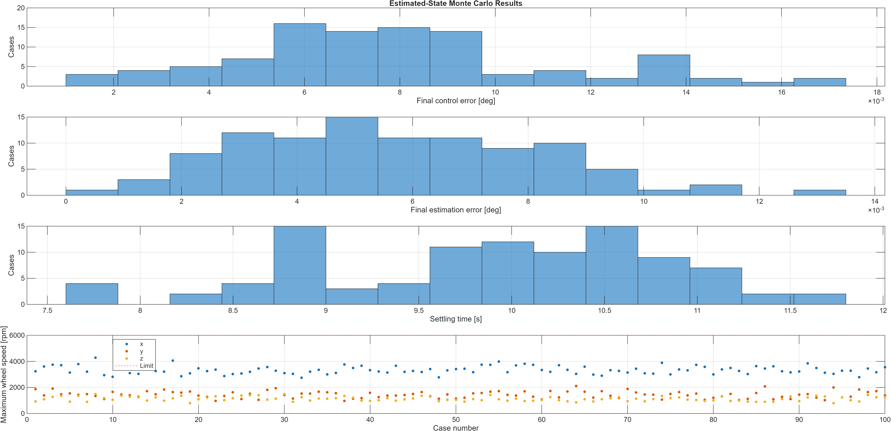
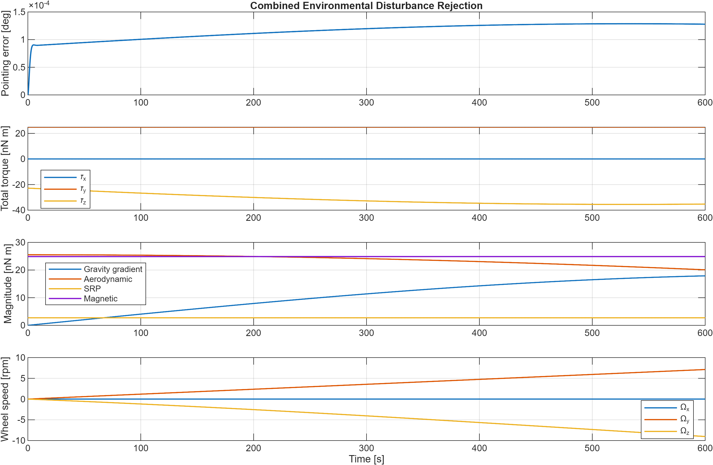
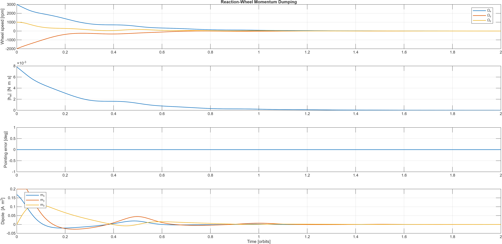
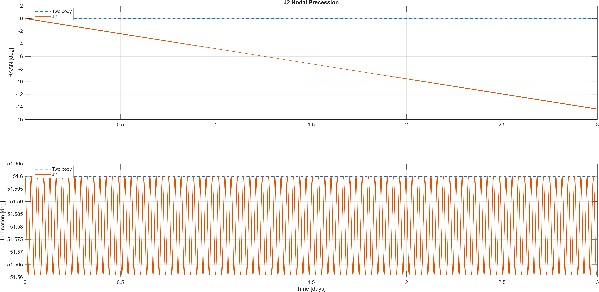
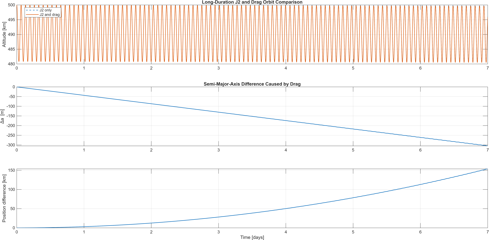

# CubeSat Attitude Determination, Control and Orbital Dynamics


[](https://github.com/mathonwyaj/CubeSat-ADCS-Simulation/actions/workflows/c-tests.yml)

An end-to-end simulation and verification project for a three-axis CubeSat
attitude determination and control system (ADCS), coupled with Low Earth Orbit
dynamics. The project progresses from a single-axis PD baseline to quaternion
control, reaction-wheel dynamics, sensor simulation, multiplicative extended
Kalman filtering (MEKF), environmental disturbances, magnetorquer momentum
dumping, Monte Carlo verification, Simulink integration and a tested C99
implementation.

> This is an engineering simulation and portfolio study. It is not a
> flight-qualified controller or validated spacecraft design.

## Headline results

| Verification area | Result |
|---|---:|
| Plant and actuator Monte Carlo | 100/100 successful cases |
| Estimated-state Monte Carlo | 100/100 successful cases |
| Worst final control error | 0.017219 deg |
| Maximum Monte Carlo wheel speed | 4286.160 rpm |
| Wheel-speed-limit cases | 0 |
| Combined-disturbance maximum pointing error | 1.287 x 10^-4 deg |
| Momentum reduction using magnetorquers | 99.931% |
| Simulink final control error | 0.000174 deg |
| C99/CTest targets | 4/4 passing |

## System architecture

```text
Gyroscope + star tracker
           |
           v
   MEKF attitude and bias estimate
           |
           v
 Quaternion error and PD controller
           |
           v
 Reaction-wheel torque and speed limits
           |
           v
  Rigid-body spacecraft dynamics
           |
           +---- Environmental disturbance torques
           |
           +---- Magnetorquer momentum unloading
```

The simulated spacecraft is a 4 kg asymmetric `0.1 x 0.2 x 0.3 m` CubeSat
with three orthogonal reaction wheels. The environmental model includes
gravity-gradient, aerodynamic, solar-radiation-pressure and residual-magnetic
torques. Orbit models include two-body propagation, J2 perturbation and a
simplified constant-density drag comparison.

## Selected engineering outputs

| Closed-loop attitude response | Estimated-state Monte Carlo |
|---|---|
|  |  |

| Disturbance rejection | Momentum dumping |
|---|---|
|  |  |

| J2 nodal precession | J2 and drag comparison |
|---|---|
|  |  |

## Three-axis quaternion ADCS

The asymmetric spacecraft inertia is:

```text
Ixx = 0.0433333 kg m^2
Iyy = 0.0333333 kg m^2
Izz = 0.0166667 kg m^2
```

The inertia-scaled controller gains are:

```text
Kp = [0.04355, 0.03350, 0.01675]
Kd = [0.06955, 0.05350, 0.02675]
```

For the combined initial attitude `[30, -20, 15] deg`, the tuned quaternion
model settled within `0.5 deg` in `10.010 s`, with approximately zero final
error and a maximum quaternion norm error of `9.379e-13`.

### Reaction-wheel design

| Parameter | Value per axis |
|---|---:|
| Wheel inertia | 2.0 x 10^-5 kg m^2 |
| Maximum torque | 0.002 N m |
| Maximum speed | 6000 rpm |
| Maximum momentum | 0.0126 N m s |

The actuator model applies torque and speed saturation, equal-and-opposite
spacecraft/wheel torque and loss of authority when a saturated wheel is
commanded farther into saturation. Resizing the wheel inertia kept nominal peak
speeds near `[3354.5, 1476.5, 1130.1] rpm` without limit activation.

## Sensors and state estimation

| Sensor property | Model value |
|---|---:|
| Gyroscope update rate | 100 Hz |
| Gyroscope noise standard deviation | 0.020 deg/s |
| Initial gyro bias | [0.050, -0.030, 0.020] deg/s |
| Star-tracker update rate | 5 Hz |
| Star-tracker noise standard deviation | 0.010 deg |

The MEKF estimates attitude and gyro bias. In the nominal estimated-state
closed loop, final control error was `0.0065 deg`, final estimation error was
`0.0031 deg`, RMS estimation error was `0.0146 deg` and settling time was
`9.92 s`.

## Environmental disturbances and momentum management

The 600 s combined-disturbance simulation produced a maximum total disturbance
of `4.336e-8 N m` and maximum pointing error of `1.287e-4 deg`.

Magnetorquer momentum unloading was tested from initial wheel speeds of
`[3000, -2000, 1000] rpm`. Wheel-momentum magnitude fell from
`7.837e-3 N m s` to `5.398e-6 N m s`, a `99.931%` reduction. The implementation
respects the physical restriction that magnetic torque is perpendicular to the
instantaneous geomagnetic field.

## Orbital dynamics

The nominal circular 500 km orbit has a speed of approximately `7.617 km/s`
and period of `94.469 min`.

### J2 validation

- Measured RAAN rate at 51.6 deg inclination: `-4.779090 deg/day`
- Theoretical RAAN rate: `-4.758999 deg/day`
- Three-day RAAN change: `-14.357100 deg`
- Two-body RAAN change: approximately zero

### Simplified drag comparison

For seven days at a constant density of `1.0e-12 kg/m^3`:

- J2-plus-drag semi-major-axis change: `-293.954 m`
- Drag-relative semi-major-axis difference: `-304.886 m`
- Final position difference: `153.719 km`

The constant-density case is a controlled engineering comparison, not a
high-fidelity orbital-lifetime prediction.

## Monte Carlo verification

The first 100-case study varies initial attitude, spacecraft inertia, wheel
inertia and available torque. The full estimated-state study additionally
varies gyro bias, gyro noise, bias random walk, star-tracker noise and initial
estimator error.

| Metric | Worst result across estimated-state cases |
|---|---:|
| Successful cases | 100/100 |
| Final control error | 0.017219 deg |
| Final estimation error | 0.013357 deg |
| RMS estimation error | 0.018918 deg |
| Settling time | 11.790 s |
| Wheel speed | 4286.160 rpm |
| Final gyro-bias error magnitude | 0.004634 deg/s |

## Simulink model

`attitude_control/cubesat_attitude_3axis.slx` implements the asymmetric
quaternion-controlled spacecraft with reaction wheels while preserving the
original single-axis baseline.

- Final attitude: approximately `[-0.000174, -0.000001, -0.000003] deg`
- Final control error: `0.000174 deg`
- Settling time: `9.9304 s`
- Maximum torque: `0.002 N m` per axis
- Maximum wheel speeds: `[3345.8, 1470.1, 1124.8] rpm`
- Maximum quaternion norm error: `8.943e-11`

## C99 implementation

The portable C implementation covers the single-axis controller, normalized
quaternion PD control, shortest-rotation sign handling, per-axis saturation,
reaction-wheel limits and the integrated ADCS command chain.

Build and run all four CTest targets from the repository root:

```powershell
cmake -S c_implementation -B c_implementation/build
cmake --build c_implementation/build --config Release
ctest --test-dir c_implementation/build -C Release --output-on-failure
```

The same clean CMake/CTest sequence runs automatically on GitHub Actions.

## MATLAB entry points

Start MATLAB in `attitude_control/`, then use:

```matlab
run_all_tests
run_attitude_monte_carlo
run_estimated_state_monte_carlo
init_simulink_3axis
build_simulink_3axis
simulink_result = sim('cubesat_attitude_3axis');
```

## Repository structure

```text
CubeSat_Project/
|-- attitude_control/   MATLAB ADCS, estimator, actuator, disturbance,
|                       Monte Carlo and Simulink files
|-- orbital_dynamics/   Original two-body orbit model
|-- c_implementation/   C99 controllers, actuator, tests and CMake
|-- results/            Saved plots and verification evidence
|-- .github/workflows/  Automated CMake and CTest workflow
|-- README.md
```

## Tools

- MATLAB R2025b
- Simulink
- C99
- CMake and CTest
- Microsoft Visual C/C++ Build Tools 2022

## Modelling limitations

- Environmental models are reduced-order engineering models.
- Atmospheric density is constant in the current drag comparison.
- The geomagnetic field is a centred, aligned dipole approximation.
- Sensor models use Gaussian noise and gyro-bias random walk.
- Flexible-body dynamics, structural vibration, thermal effects, detailed
  power constraints and communication delays are outside the current scope.
- Hardware-in-the-loop and on-orbit validation have not been performed.

## Author

**Mathonwy Akiwumi-Jones**  
[GitHub](https://github.com/mathonwyaj) | [LinkedIn](https://www.linkedin.com/in/mathonwy-akiwumi-jones-342910374/)
